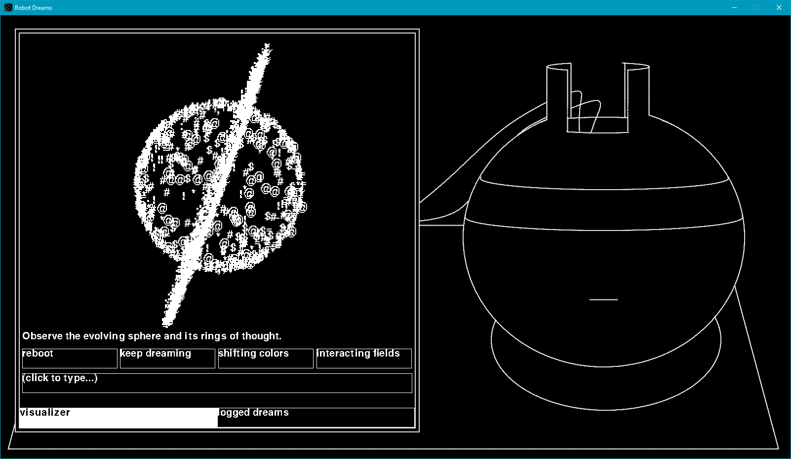

# Robot Dreams 🤖💤🪐

You've been sent a robot frozen under the permafrost for a century, perfect for your experiments on dreaming.

Prompt it and see what kinds of games and visualizations it comes up with!

You can run it in Python 3 using `python main.py`, with everything from `requirements.txt` installed.

Make sure you have a Gemini API key configured in your environment variables and you understand your quotas. See https://ai.google.dev/gemini-api/docs/api-key and specifically 'Setting the API key as an environment variable'.

Each time you press 'enter' in the prompt bar or click a suggested next evolution, you will make a request to Gemini `gemini-2.5-flash`. You can specify a different model to use in `util.py`.

### With Time and Focus I Would...
- Fix all the wrapping, lots of text can run off screen.
- Give the LLM a 'get_text_rect' function, right now it doesn't justify text well.
- Rework this into a web app where you can continue evolving other peoples' programs.
- Cleanup everything, but especially drawing. Right now, different UI components render different places.
